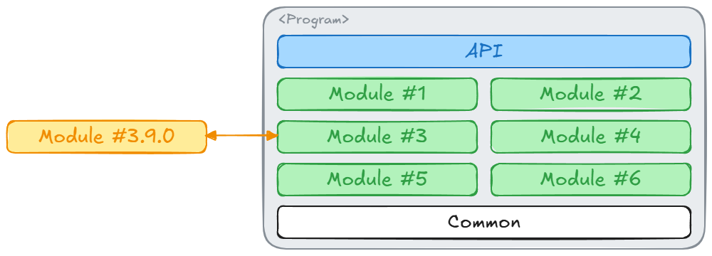

# Modular Monolith MediatR Example

## Problem Statement

A `Modular Monolith` using `Clean Architecture` with the `MediatR` library in C# is a particular topic I've recently
encountered. Please don't confuse this repo as an argument for or against these ideas - I am using this repo as a 
means of communicating (to myself and others) how I would orchestrate these ideas.

_Note: Concepts above are broadly explained here, but it's important that you look into these concepts individually 
first before interacting with the ideas below._

## Context

### Modular Monolith (MM)

Let's start with the MM, as it's the largest abstraction (in terms of scope) on our list. An MM is a Software
Architectural Pattern that stipulates a large project structure is broken down into discrete chunks (modules). 
"Monolith" meaning the system has exactly ONE deployment unit. "Modular" meaning the system's design emphasises the
separation of functionality into `independant interchangeable sections`. In other words "One program, Decoupled 
Features/Ideas".

Here, we have ONE deployment. A large program with some generic interface (HTTP, CLI, doesn't matter). Modules
implement features of the program, with the theory being that `Module 3` can be replaced by `Module 3.9.0` without
requiring any changes to the other modules. To avoid repeating ourselves, there is the bottom layer - `Common`. This
layer has implementation-agnostic components that are utilized throughout multiple modules. 

At this point, you might be asking "So how do modules interact?". It's a great question, that we will come back to 
in a moment. Before we do that though, we must understand how Clean Architecture plays a role.

### Clean Architecture (CA)

CA is another Software Design Pattern with a primary focus on `independent business-logic` - business-logic that is not
tightly coupled to libraries or other external tools (Databases, SQS, etc.). The core business-logic itself deals 
with Plain Old CSharp Objects (POCOs), creating contracts that an unknown component will fulfil at runtime.

Bringing back the idea of an MM (see diagram above), each module independently implements its own business-logic - 
such that it's not reliant or tied to any one 