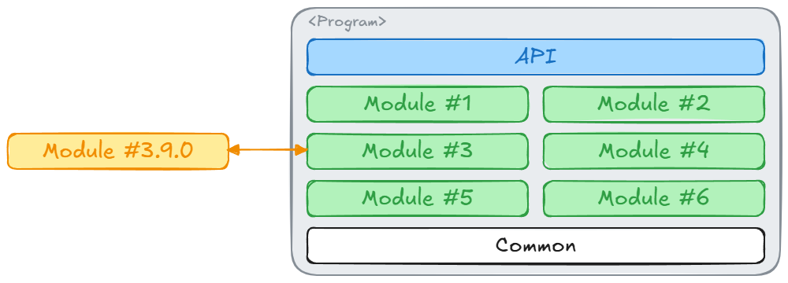
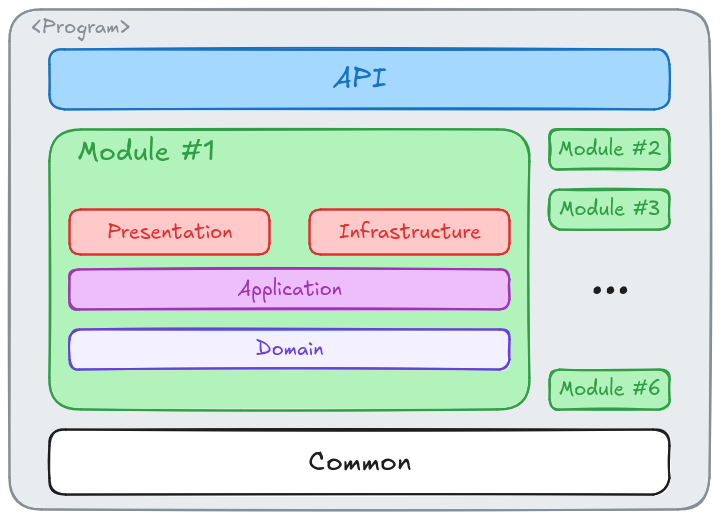

# Modular Monolith MediatR Example

## Problem Statement

A `Modular Monolith` using `Clean Architecture` with the `MediatR` library in C# is a particular topic I've recently
encountered. Please don't confuse this repo as an argument for or against these ideas - I am using this repo as a 
means of communicating (to myself and others) how I would orchestrate these ideas.

_Note: Concepts above are broadly explained here, but it's important that you look into these concepts individually 
first before interacting with the ideas below._

## Context

### Modular Monolith (MM)

Let's start with the MM, as it's the largest abstraction (in terms of scope) on our list. An MM is a Software
Architectural Pattern that stipulates a large project structure is broken down into discrete chunks (modules). 
"Monolith" meaning the system has exactly ONE deployment unit. "Modular" meaning the system's design emphasises the
separation of functionality into `independant interchangeable sections`. In other words "One program, Decoupled 
Features/Ideas".



Here, we have ONE deployment. A large program with some generic interface (HTTP, CLI, doesn't matter). Modules
implement features of the program, with the theory being that `Module 3` can be replaced by `Module 3.9.0` without
requiring any changes to the other modules. To avoid repeating ourselves, there is the bottom layer - `Common`. This
layer has implementation-agnostic components that are utilized throughout multiple modules. 

At this point, you might be asking "So how do modules interact?". It's a great question, that we will come back to 
in a moment. Before we do that though, we must understand how Clean Architecture plays a role.

### Clean Architecture (CA)

CA is another Software Design Pattern with a primary focus on `independent business-logic` - business-logic that is not
tightly coupled to libraries or other external tools (Databases, SQS, etc.). The core business-logic itself deals 
with Plain Old CSharp Objects (POCOs), creating contracts that an unknown component will fulfil at runtime.

Combining this base idea with those from the MM (MMCR) - we have decoupled features (modules), where the business 
logic for each of module is decoupled from external resources... simple:



In our module, we have the "presentation" and "infrastructure" layers. In a CA only project, these layers could be 
considered our IO - where the presentation layer offers some interface for input, and the infrastructure layer 
connects to the outside world for outputs. **This is a critical re-interpretation of CA for the next section**.

### MediatR

The MediatR library in C# can be used to decouple message passing in OOP. Like CQRS, messages are handed off to a 
mediator, where the mediator then routes the message to the relevant entities. Can you see where this is going? Our 
API acts as our entry point into the program. It's the glue that links all the modules.

So, using MMCR, our business logic will need to write contracts for it's expected domain specific business logic.
These contracts implement the `IRequest` class. Our business logic can then call these contracts into action through the
mediator. Thus, our business logic has set the contract, and utilized the contract, with no direct connection to the 
logic with whom resolved the contract.

```c#
// Application Layer

public class GetUserRequest(Guid userId) : IRequest<MmmeUser?> { public Guid UserId { get; } = userId; }

public class UserManagement(IMediator mediator)
{
    public async Task<MmmeUser?> GetUserWithId(Guid guid) => await mediator.Send(new GetUserRequest(guid));
}
```

```c#
// Infrastructure Layer

public class GetUserHandler : IRequestHandler<GetUserRequest, MmmeUser?>
{
    public Task<MmmeUser?> Handle(GetUserRequest request, CancellationToken cancellationToken)
    {
        return Task.FromResult(InMemDbExample.UserDb.Find(u => u.Id.Equals(request.UserId)));
    }
}

```

### Building Beyond

Using this type of SERIOUSLY decoupled programming, we can also achieve inter-module communication. For example, 
lets say we expose an API endpoint to the user `host/profile`. This request will feature profile information, and 
return it in a JSON string. Let's say now, that some other module would like to also grab this information, all we 
would need to do, is to set up MediatR endpoint, and extra the core functionality into a function that both 
endpoints can call. The following example is mostly pseudocode:

```C#
app.MapGet("/profile", GetProfile);

// ...

public class GetProfile : IRequestHandler<GetProfile, string>
{
    public Task<string> Handle(GetUserRequest request, CancellationToken cancellationToken) => GetProfile()
}

// ...

public async Task<string> GetProfile() { /*...*/ }
```

Now our `GetProfile` method is available as an HTTP endpoint or via the Mediator. This is just one example. 
The same idea could be applied with "NotificationHandler", where such an implementation would enable other
modules to trigger some "sync" functionality, allowing a function to be called independently OR be triggered
after an event.

### Breaking The Rules!

Now, you might be thinking "Wait a second, we are breaking the rules of CA where we are heavily reliant on 
the MediatR library in our Application layer". There are most certainly work arounds to ensure that this is 
not the case. Given the broad reaching nature of the MediatR library, we can install the library into
our "Common" layer, and create some definitions for "Contract" defining in there. Therefore, our modules would 
rely on the "Common" layer (which follows our pattern), and then our "Common" layer would provide interfacing with
the MediatR library, such that changing to another Mediator library would require updating the interfaces inside
the "Common" code only. My examples above avoided implementing this additional layer of abstraction, to demonstrate
the core concepts themselves, but utilizing that "Common" project to decouple modules from MediatR is the next step
to completing the ideas presented in this document.
